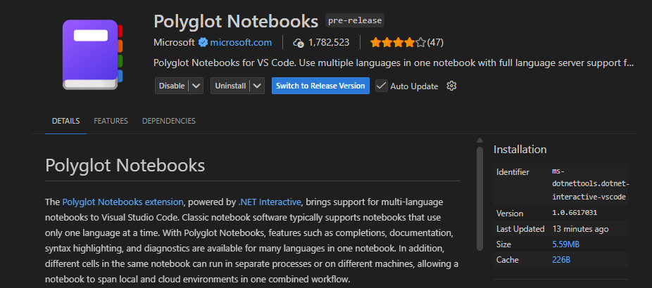

# Microsoft Agent Framework

## 🤖 Introduction

The **Microsoft Agent Framework** is an open-source development kit for building **AI agents** and **multi-agent workflows** for .NET and Python. It brings together and extends ideas from the Semantic Kernel and AutoGen projects, combining their strengths while adding new capabilities. Built by the same teams, it is the unified foundation for building AI agents going forward.

The Agent Framework offers two primary categories of capabilities:

### 🤖 AI Agents
Individual agents that use LLMs to process user inputs, call tools and MCP servers to perform actions, and generate responses. AI agents are suitable for applications that require:
- **Autonomous Decision-Making**: Dynamic problem-solving without predefined sequences
- **Tool Integration**: Seamless interaction with external APIs, databases, and services
- **Conversation Management**: Multi-turn conversations with persistent context
- **Model Flexibility**: Support for Azure OpenAI, OpenAI, and Azure AI providers

### 🔄 Workflows  
Graph-based workflows that connect multiple agents and functions to perform complex, multi-step tasks. Workflows provide:
- **Structured Orchestration**: Explicit control over multi-agent execution paths
- **Type Safety**: Strong typing with comprehensive validation
- **Checkpointing**: State persistence for long-running processes
- **Human-in-the-Loop**: Built-in patterns for human interaction and approval

### 🎯 Why Agent Framework?

The Agent Framework is the **direct successor** to Semantic Kernel and AutoGen, created by the same teams. It combines:
- **AutoGen's** simple abstractions for single- and multi-agent patterns
- **Semantic Kernel's** enterprise-grade features (thread management, type safety, telemetry)
- **New capabilities** including robust workflows and advanced state management

> **Note**: Microsoft Agent Framework is currently in **public preview**. This represents the next generation of both Semantic Kernel and AutoGen.

### 📚 Learn More

- 📖 **Official Documentation**: [Agent Framework Overview](https://learn.microsoft.com/en-us/agent-framework/overview/agent-framework-overview)
- 🔗 **GitHub Repository**: [Microsoft Agent Framework](https://github.com/microsoft/agent-framework) - Additional examples and source code
- 🚀 **Get Started**: Follow the notebooks below for hands-on learning

---

This folder contains examples demonstrating different ways to create and use agents with Azure AI using the `Microsoft.Agents.AzureAI` NuGet package in .NET 10 / C# Polyglot Notebooks.

## 📚 Available Notebooks

### Basic Examples
- **`azure_ai_basic.ipynb`** - Basic Azure AI agent usage with automatic lifecycle management
- **`azure_ai_with_explicit_settings.ipynb`** - Creating agents with explicit configuration settings

### Agent Management
- **`azure_ai_with_existing_agent.ipynb`** - Working with pre-existing agents using agent IDs
- **`azure_ai_with_existing_thread.ipynb`** - Managing conversation threads for continuity

### Tool Integration
- **`azure_ai_with_function_tools.ipynb`** - Comprehensive function tool integration patterns
- **`azure_ai_with_code_interpreter.ipynb`** - Code execution and mathematical problem solving
- **`azure_ai_with_file_search.ipynb`** - Document-based question answering with file uploads

### Advanced Features
- **`azure_ai_with_bing_grounding.ipynb`** - Web search integration using Bing Grounding

## 🚀 Getting Started

### Prerequisites

1. **Install .NET 10 SDK**: Ensure you have the [.NET 10 SDK](https://dotnet.microsoft.com/download/dotnet/10.0) installed:
   ```bash
   dotnet --version
   ```

2. **Install Polyglot Notebooks Extension**: Install the [Polyglot Notebooks](https://marketplace.visualstudio.com/items?itemName=ms-dotnettools.dotnet-interactive-vscode) extension in VS Code.

You might need to swap to the "Pre-Release" version in order to run these notebooks. Validate that you are on version `1.0.6617031` or greater:



3. **Install NuGet Packages**: The notebooks will install the required packages automatically, but you can also install them manually:

   **Full Framework** - Install the entire framework with all integrations (simplest approach):
   ```csharp
   #r "nuget: Microsoft.Agents, *-*"
   ```
   This installs the core and every integration package, making sure that all features are available without additional steps. The `*-*` version pattern includes preview packages while Agent Framework is in preview.

   **Selective Install** - Install only specific integrations to keep dependencies lighter:
   ```csharp
   // Core only (includes Azure OpenAI and OpenAI support by default)
   #r "nuget: Microsoft.Agents.Core, *-*"

   // Core + Azure AI integration
   #r "nuget: Microsoft.Agents.AzureAI, *-*"

   // Core + Microsoft Copilot Studio integration
   #r "nuget: Microsoft.Agents.CopilotStudio, *-*"
   ```

   **Supported Platforms:** .NET 10+, Windows/macOS/Linux

4. **Azure Authentication**: Authenticate with Azure CLI:
   ```bash
   az login
   ```

5. **Environment Configuration**: Set up your environment variables by copying the sample file:

   Copy the .env_sample file to create a .env file:
   ```bash
   cp .env_sample .env
   ```

   Edit the .env file and add your values:
   ```
   AZURE_AI_PROJECT_ENDPOINT="your-project-endpoint"
   AZURE_AI_MODEL_DEPLOYMENT_NAME="your-model-deployment-name"
   TENANT_ID="your-tenant-id"
   ```

   For samples using Bing Grounding search (like `azure_ai_with_bing_grounding.ipynb`), you'll also need:
   ```
   BING_CONNECTION_ID="/subscriptions/{subscription-id}/resourceGroups/{resource-group}/providers/Microsoft.CognitiveServices/accounts/{ai-service-name}/projects/{project-name}/connections/{connection-name}"
   ```

   To get your Bing connection ID:
   - Go to Azure AI Foundry portal
   - Navigate to your project's "Connected resources" section
   - Add a new connection for "Grounding with Bing Search"
   - Copy the connection ID

### Running the Notebooks

1. **Open in VS Code**: Open VS Code in this folder and ensure the Polyglot Notebooks extension is installed

2. **Open Notebooks**: Open any of the `.ipynb` files in this directory

3. **Select Kernel**: When prompted, select the **.NET Interactive** kernel (C#)

4. **Execute**: Run the cells in order, following the explanations and examples

## 📖 Learning Path

### Beginner
1. Start with `azure_ai_basic.ipynb` to understand fundamental concepts
2. Try `azure_ai_with_explicit_settings.ipynb` for configuration patterns
3. Explore `azure_ai_with_function_tools.ipynb` for tool integration

### Intermediate
1. Learn agent persistence with `azure_ai_with_existing_agent.ipynb`
2. Master conversation management with `azure_ai_with_existing_thread.ipynb`
3. Implement document search with `azure_ai_with_file_search.ipynb`

### Advanced
1. Integrate web search with `azure_ai_with_bing_grounding.ipynb`
2. Execute code dynamically with `azure_ai_with_code_interpreter.ipynb`

## 🔧 Key Features Demonstrated

### Core Concepts
- ✅ Agent creation and lifecycle management
- ✅ Authentication patterns with Azure CLI and `DefaultAzureCredential`
- ✅ Environment configuration and best practices
- ✅ Error handling and resource cleanup with `IAsyncDisposable`

### Tool Integration
- ✅ Function tools for custom capabilities using C# delegates
- ✅ Code interpreter for dynamic code execution
- ✅ File search for document-based Q&A
- ✅ Web search with Bing integration
- ✅ External API integration via OpenAPI

### Advanced Patterns
- ✅ Multi-turn conversations with `await foreach`
- ✅ Thread management and persistence
- ✅ Agent reuse patterns
- ✅ Tool combination strategies
- ✅ User approval workflows

## 💡 Tips for Success

1. **Environment Setup**: Ensure all environment variables are properly configured
2. **Authentication**: Keep your Azure CLI session active or use managed identity
3. **Resource Management**: Use `await using` for proper async disposal of resources
4. **Error Handling**: Pay attention to error handling patterns in the examples
5. **NuGet Packages**: Use the `*-*` version pattern to get the latest preview packages

## 🛠️ Troubleshooting

### Common Issues

1. **Authentication Errors**: Run `az login` and verify your credentials. Ensure `Azure.Identity` package is installed.
2. **Missing Environment Variables**: Check that all required variables are set in your `.env` file
3. **NuGet Package Errors**: Ensure you're using the `*-*` version pattern for preview packages, or specify a specific version
4. **Kernel Not Found**: Ensure the Polyglot Notebooks extension is installed and .NET 10 SDK is available
5. **Resource Not Found**: Verify your Azure AI project configuration and connection strings

