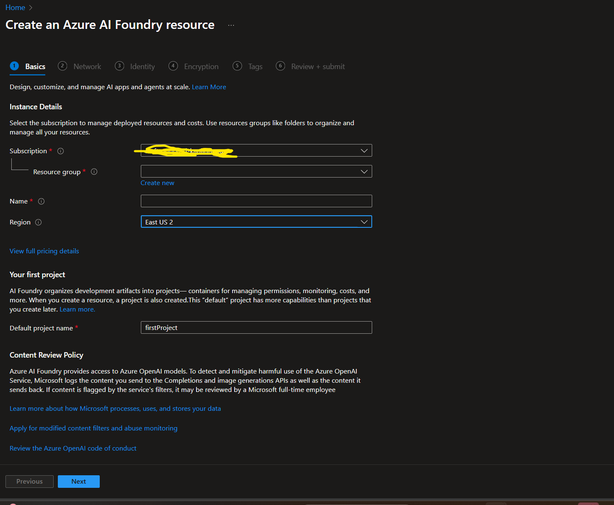
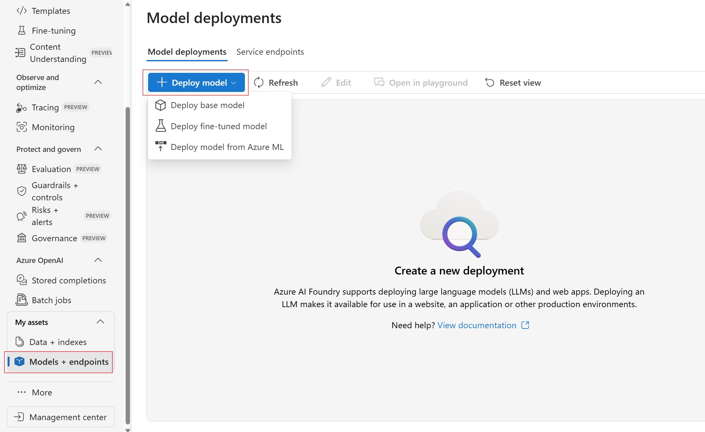
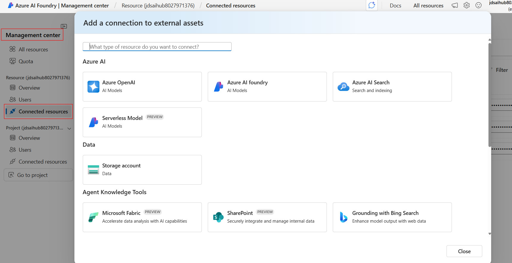
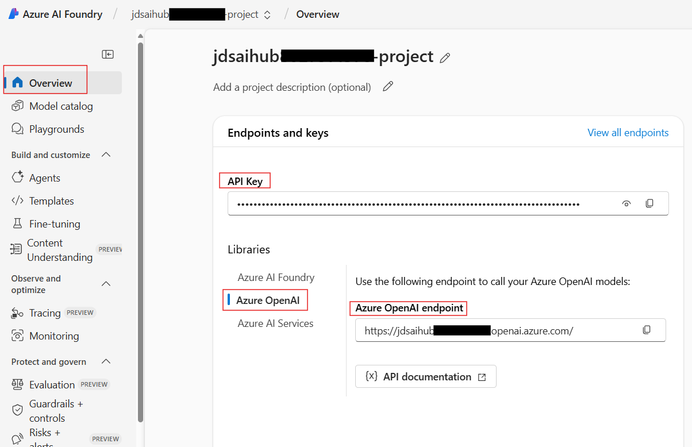

# 🚀 Azure AI Foundry & Agents Workshop

[](https://ai.azure.com)
[](https://dotnet.microsoft.com/)
[](https://jupyter.org)

**End-to-End Azure AI Foundry And Agents Development Laboratory**

*Master Azure AI Foundry and Agents through hands-on experimentation and real-world applications*

---

🎯 [Getting Started](#-getting-started) • 📚 [Learning Path](#-learning-path) • 🔧 [Setup Guide](./infrastructure/readme.md) • 🛠️ [Troubleshooting](#-troubleshooting--support)

---

## 🎯 Mission Statement

This comprehensive laboratory transforms you from an AI enthusiast into an Azure AI Foundry expert. Through progressive, hands-on modules, you'll master:

1. Setup, Authentication, Quick Start
2. Prompting, Embeddings, RAG
3. Agents – File Search, Bing, Azure Functions, Multi-Agent
4. Model Context Protocol (MCP) with Agents
5. AI Red Teaming & Security Testing
6. Agent Framework – Advanced Agent Development
7. Observability & Evaluation
8. AI Language Services with Low-Code Workflows
9. AI Vision with Low-Code Solutions
10. Content Understanding & Document Classification
11. Responsible AI & Content Safety


> **🎓 Laboratory Format**: One day intensive hands-on experience  
> **🎯 Target Audience**: Developers, AI practitioners, and solution architects  
> **💡 Learning Approach**: Progressive complexity with real-world applications

---

## 📁 Repository Structure

```
agentic-ai-lab/
├── 📚 1. initial-setup/           # Start here - Authentication & environment setup
├── 💬 2. chat-rag/               # Chat completion and RAG fundamentals
├── 🤖 3. agents/                 # AI Agents development and tools (includes multi-agent)
├── 🔌 4. agents-with-mcp/        # Model Context Protocol (MCP) integration
├── 🔴 5. ai-red-teaming-agent/   # AI Red Teaming and Security Testing
├── 🤖⚙️ 6. agent-framework/        # Microsoft Agent Framework for advanced agent development
├── 📊 7. observability-and-evaluations/         # Monitoring, evaluation, and quality assurance
├── 🗣️ 8. ai-language/             # AI Language Services with Logic Apps low-code workflows
├── 👁️ 9. ai-vision/               # AI Vision Services with low-code solutions
├── 📄 10. content-understanding/   # Document classification and content extraction
└── 🛡️ 11. responsible-ai/          # Responsible AI, Content Safety, and PII Detection
```

---
## 🚀 Getting Started
### Step 1: Repository Setup

```powershell
# Clone the laboratory repository
git clone https://github.com/microsoft/agentic-ai-lab-dotnet.git
cd agentic-ai-lab

# Verify Python version
dotnet --version  # Should be 10.0.0 or higher
```

### Step 2: Azure AI Foundry Setup

1. **Create Azure AI Foundry Resource and Project**
   
   To create an AI Foundry resource in the Azure portal follow these instructions:

   - Select this AI Foundry resource link: https://portal.azure.com/#create/Microsoft.CognitiveServicesAIFoundry

   - On the Create page, provide the following information:

   

   | Project details | Description |
   |----------------|-------------|
   | **Subscription** | Select one of your available Azure subscriptions. |
   | **Resource group** | The Azure resource group that will contain your Azure AI Foundry resource. You can create a new group or add it to a preexisting group. |
   | **Region** | The location of your Azure AI service instance. Different locations may introduce latency, but have no impact on the runtime availability of your resource. |
   | **Name** | A descriptive name for your Azure AI Foundry resource. For example, MyAIServicesResource. |
   | **Default Project Name** | Keep the default project as it is. |

   - Keep other settings for your resource as default, read and accept the conditions (as applicable), and then select **Review + create**.
   
2. **Deploy Required Models & Services**
   
   | Model Type | Recommended Models | Purpose |
   |------------|-------------------|---------|
   | **Chat/Completion** | `gpt-4o`, `gpt-4o-mini` | Primary reasoning & conversation |
   | **Text Embeddings** | `text-embedding-3-large` | Vector search & RAG |

   - On the left Nav Menu of the foundry portal go to Models+endpoints
   - Click Deploy a model button-->Deploy base model
      - Search for the models in the table above , select a model, click confirm and Deploy and connect
       

3. **Configure an Azure Search Service**
   - Create an Azure AI Search resource in Azure
   - Connect this resource to your AI Foundry project
      - Navigate to your AI Foundry project → Management Center → Connected Resources → Add Connection → Select Azure AI Search
      

4. **Configure Grounding with Bing Search**
   - Create a new Grounding with Bing Search resource in Azure
   - Connect this resource to your AI Foundry project
      - Navigate to your AI Foundry project → Management Center → Connected Resources → Add Connection → Select Grounding with Bing Search

5. **Create Content Understanding Resource**
   - Create an Azure AI Content Understanding multi-service resource following the [official documentation](https://learn.microsoft.com/en-us/azure/ai-services/content-understanding/how-to/create-multi-service-resource)
   - Ensure the resource is created in a supported region (westus, swedencentral, australiaeast)
  
6. **Configure Environment Variables**
   - Copy `.env.example` to `.env` in the root directory and update values accordingly
   - This repository expects the `.env` file to be in the root directory, if you want to store it elsewhere or name it something else, update the `load_dotenv()` calls in notebooks
   - Many of the Environment Variables needed can be found in the Overview tab of your Azure AI Foundry project or the connected resources in the Management Center tab
   - For example, AZURE_OPENAI variables-
  

---

## 📚 Learning Path

Follow this structured learning path to master Azure AI Foundry:

### 🎯 Phase 1: Foundation (Start Here)
**Location:** `1. initial-setup/`

| Notebook | Description |
|----------|-------------|
| 🚀 [Quick Start](1.%20initial-setup/quick_start.ipynb) | First AI model interaction |

### 💬 Phase 2: Chat & RAG Fundamentals
**Location:** `2. chat-rag/`

| Notebook | Description |
|----------|-------------|
| 💬 [Basic Chat Completion](2.%20chat-rag/1-basic-chat-completion.ipynb) | Foundation models and prompting |
| 🔍 [Embeddings](2.%20chat-rag/2-embeddings.ipynb) | Vector representations and similarity |
| 📚 [Basic RAG](2.%20chat-rag/3-basic-rag.ipynb) | Retrieval-Augmented Generation |

### 🤖 Phase 3: AI Agents Development  
**Location:** `3. agents/`

| Notebook | Description |
|----------|-------------|
| 🤖 [Agent Basics](3.%20agents/1-basics.ipynb) | Fundamental agent concepts |
| 💻 [Code Interpreter](3.%20agents/2-code_interpreter.ipynb) | Code execution capabilities |
| 📄 [File Search](3.%20agents/3-file-search.ipynb) | Document processing |
| 🌐 [Bing Grounding](3.%20agents/4-bing_grounding.ipynb) | Web search integration |
| 🔍 [Agents + AI Search](3.%20agents/5-agents-aisearch.ipynb) | Enterprise search integration |
| ⚡ [Agents + Azure Functions](3.%20agents/6-agents-az-functions.ipynb) | Serverless integration |
| 👥 [Multi-Agent Solution](3.%20agents/multi-agent-solution.ipynb) | Collaborative AI systems |

### 🔌 Phase 4: Model Context Protocol (MCP) Integration
**Location:** `4. agents-with-mcp/`

| Implementation | Description |
|----------|-------------|
| 🔌 [MCP Inventory Agent](4.%20agents-with-mcp/README.md) | Complete working implementation of agents that connect to MCP servers for dynamic tool discovery. Features an intelligent inventory management agent for a cosmetics retailer with automated restock and clearance recommendations. Includes both client and server implementations with interactive chat interface. |

### 🔴 Phase 5: AI Red Teaming & Security Testing (Coming Soon)
**Location:** `5. ai-red-teaming-agent/`

| Implementation | Description |
|----------|-------------|
| 🔴 [AI Red Teaming Agent](5.%20ai-red-teaming-agent/README.md) | Advanced AI security testing and vulnerability assessment using red teaming methodologies. Features automated adversarial prompt generation, safety evaluation, and comprehensive security analysis of AI systems. |

### 🤖⚙️ Phase 6: Microsoft Agent Framework
**Location:** `6. agent-framework/`

The **Microsoft Agent Framework** is an open-source development kit that unifies and extends Semantic Kernel and AutoGen into the next-generation foundation for AI agent development. Built by the same teams, it offers two primary capabilities: **AI Agents** for autonomous decision-making with tool integration and conversation management, and **Workflows** for orchestrating complex multi-agent processes with type safety and checkpointing. Currently in public preview, it combines AutoGen's simple abstractions with Semantic Kernel's enterprise features while adding robust workflow capabilities.

📖 [Official Documentation](https://learn.microsoft.com/en-us/agent-framework/overview/agent-framework-overview) • 🔗 [GitHub Repository](https://github.com/microsoft/agent-framework) • 📚 [Complete Guide](6.%20agent-framework/README.md)

#### 🤖 Azure AI Agents (`agents/azure_ai_agents/`)
| Notebook | Description |
|----------|-------------|
| 🤖 [Basic Agent Usage](6.%20agent-framework/agents/azure_ai_agents/azure_ai_basic.ipynb) | Fundamental agent concepts with automatic lifecycle management |
| ⚙️ [Explicit Settings](6.%20agent-framework/agents/azure_ai_agents/azure_ai_with_explicit_settings.ipynb) | Agent creation with explicit configuration patterns |
| 🔄 [Existing Agent Management](6.%20agent-framework/agents/azure_ai_agents/azure_ai_with_existing_agent.ipynb) | Working with pre-existing agents using agent IDs |
| 💬 [Thread Management](6.%20agent-framework/agents/azure_ai_agents/azure_ai_with_existing_thread.ipynb) | Conversation thread continuity and management |
| 🔧 [Function Tools](6.%20agent-framework/agents/azure_ai_agents/azure_ai_with_function_tools.ipynb) | Comprehensive function tool integration patterns |
| 💻 [Code Interpreter](6.%20agent-framework/agents/azure_ai_agents/azure_ai_with_code_interpreter.ipynb) | Python code execution and mathematical problem solving |
| 📄 [File Search](6.%20agent-framework/agents/azure_ai_agents/azure_ai_with_file_search.ipynb) | Document-based question answering with file uploads |
| 🌐 [Bing Grounding](6.%20agent-framework/agents/azure_ai_agents/azure_ai_with_bing_grounding.ipynb) | Web search integration using Bing Grounding |

#### 🔌 Model Context Protocol (`agents/mcp/`)
| Implementation | Description |
|----------|-------------|
| 🔌 [Azure AI with MCP](6.%20agent-framework/agents/mcp/azure_ai_with_mcp.ipynb) | Hosted MCP tools with Azure AI Foundry agents (basic, multi-tool, thread-based examples) |
| 🖥️ [Agent as MCP Server](6.%20agent-framework/agents/mcp/agent_as_mcp_server.py) | Expose Agent Framework agents as MCP servers |
| 🔐 [MCP API Key Auth](6.%20agent-framework/agents/mcp/mcp_api_key_auth.py) | API key authentication patterns for MCP servers |

#### 🔄 Workflows (`workflows/`)
| Category | Description |
|----------|-------------|
| 📚 [Start Here](6.%20agent-framework/workflows/_start-here/) | Foundational workflow concepts, executors, edges, agents, streaming |
| 🎯 [Orchestration](6.%20agent-framework/workflows/orchestration/) | Sequential and concurrent agent coordination patterns |
| 💾 [Checkpointing](6.%20agent-framework/workflows/checkpointing/) | State persistence for long-running workflows |
| 👤 [Human-in-the-Loop](6.%20agent-framework/workflows/human-in-the-loop/) | Interactive approval and feedback patterns |
| 🧠 [Magentic](6.%20agent-framework/workflows/magentic/) | AI-driven multi-agent planning and execution |

#### 🛡️ Middleware (`middleware/`)
| Notebook | Description |
|----------|-------------|
| 🔧 [Agent & Run Level](6.%20agent-framework/middleware/1-agent_and_run_level_middleware.ipynb) | Middleware fundamentals and scoping |
| 🔨 [Function-Based](6.%20agent-framework/middleware/2-function_based_middleware.ipynb) | Function-based middleware patterns |
| 🏗️ [Class-Based](6.%20agent-framework/middleware/3-class_based_middleware.ipynb) | Class-based middleware with inheritance |
| 🎨 [Decorator Middleware](6.%20agent-framework/middleware/4-decorator_middleware.ipynb) | @agent_middleware and @function_middleware decorators |
| 💬 [Chat Middleware](6.%20agent-framework/middleware/5-chat_middleware.ipynb) | Message interception and modification |
| ⚠️ [Exception Handling](6.%20agent-framework/middleware/6-exception_handling_with_middleware.ipynb) | Error handling and recovery patterns |
| 🛑 [Termination](6.%20agent-framework/middleware/7-middleware_termination.ipynb) | Early termination and control flow |
| 🔄 [Result Override](6.%20agent-framework/middleware/8-override_result_with_middleware.ipynb) | Streaming and non-streaming result modification |
| 📦 [Shared State](6.%20agent-framework/middleware/9-shared_state_middleware.ipynb) | State management with middleware containers |

#### 🧠 Context Providers (`context_providers/`)
| Notebook | Description |
|----------|-------------|
| 💾 [Azure AI Memory](6.%20agent-framework/context_providers/1-azure_ai_memory_context_providers.ipynb) | Agent memory with user fact extraction, tone detection, and persistent context |

#### 🧵 Threading & Conversation Management (`threads/`)
| Notebook | Status | Description |
|----------|--------|-------------|
| 💬 [Azure AI Thread Serialization](6.%20agent-framework/threads/1-azure-ai-thread-serialization.ipynb) | ✅ | Service-managed threads with cloud storage (~50 bytes serialization) |
| 🔧 [Custom Message Store](6.%20agent-framework/threads/2-custom_chat_message_store_thread.ipynb) | ✅ Tested | Custom `ChatMessageStoreProtocol` implementation (converted from Python script) |
| 📦 [Redis Message Store](6.%20agent-framework/threads/3-redis_chat_message_store_thread.ipynb) | ⚠️ Requires Redis | Distributed conversation storage with 5 comprehensive examples |
| 🔄 [Suspend/Resume Threads](6.%20agent-framework/threads/4-suspend_resume_thread.ipynb) | ✅ Tested | Service-managed & in-memory thread persistence patterns (converted from Python script) |

#### 📊 Observability (`observability/`)
| Notebook | Description |
|----------|-------------|
| 👁️ [Agent Observability](6.%20agent-framework/observability/1-azure_ai_agent_observability.ipynb) | Trace LLM calls, tool executions, token usage with Application Insights |
| 💬 [Chat Client Observability](6.%20agent-framework/observability/2-azure_ai_chat_client_with_observability.ipynb) | Monitor Azure AI chat clients with multiple tools |

#### 🎨 Development UI (`devui/`)
| Implementation | Description |
|----------|-------------|
| 🌐 [In-Memory Mode](6.%20agent-framework/devui/in_memory_mode.py) | Quick-start web interface for testing agents |
| 📁 [Sample Agents](6.%20agent-framework/devui/) | Pre-built examples: Foundry agent, weather agent, spam workflow, fanout workflow |

### 📊 Phase 7: Quality & Operations (Coming Soon)
**Location:** `7. observability-and-evaluations/`

| Notebook | Description |
|----------|-------------|
| 👁️ [Observability](7.%20observability-and-evaluations/1-Observability.ipynb) | Monitoring and telemetry |
| 📈 [Evaluation](7.%20observability-and-evaluations/2-evaluation.ipynb) | Quality assessment and benchmarking |

### 🗣️ Phase 8: AI Language Services with Low-Code Workflows (Coming Soon)
**Location:** `8. ai-language/`

| Implementation | Description |
|----------|-------------|
| 🔤 [AI Language Service Lab](8.%20ai-language/README.md) | Low-code Logic Apps for PII removal, language detection, and translation. Build workflow solutions for processing multilingual customer feedback with privacy compliance and centralized analytics. |

### 👁️ Phase 9: AI Vision Services with Low-Code Solutions (Coming Soon)
**Location:** `9. ai-vision/`

| Implementation | Description |
|----------|-------------|
| 👀 [AI Vision Lab Guide](9.%20ai-vision/README.md) | Azure AI Vision low-code exercises including OCR, face detection, image analysis, and video indexing using Vision Studio |
| 📓 [AI Vision Services Notebook](9.%20ai-vision/LabFiles/AI_vision_services_lab.ipynb) | Hands-on Jupyter notebook for computer vision capabilities |

### 📄 Phase 10: Content Understanding & Document Classification (Coming Soon)
**Location:** `10. content-understanding/`

| Implementation | Description |
|----------|-------------|
| 📄 [Content Understanding Lab Guide](10.%20content-understanding/README.md) | Azure AI Content Understanding for document classification and field extraction from bundled PDF files |
| 📓 [Classifier Notebook](10.%20content-understanding/classifier.ipynb) | Hands-on Jupyter notebook for building document classifiers and analyzers |
| 🐍 [Content Understanding Client](10.%20content-understanding/content_understanding_client.py) | Python client implementation for Azure AI Content Understanding API |
| 📋 [Sample Data](10.%20content-understanding/Data/) | Sample PDF documents for testing classification and extraction workflows |

### 🛡️ Phase 11: Responsible AI & Content Safety (Coming Soon)
**Location:** `11. responsible-ai/`

| Implementation | Description |
|----------|-------------|
| 🛡️ [Responsible AI Lab Guide](11.%20responsible-ai/README.md) | Comprehensive exploration of AI safety including manual and automated evaluations, content safety filters, PII detection and masking |
| 📊 [Evaluation Data](11.%20responsible-ai/Files/Evaluations/) | Manual and automated evaluation datasets for AI model testing |
| 🛡️ [Content Safety Data](11.%20responsible-ai/Files/Content_Safety/) | Bulk datasets for text and image moderation testing |
| 📚 [Sample Documents](11.%20responsible-ai/Files/Contoso/) | Corporate documents for PII detection and content analysis exercises |

---

## 🔧 Environment Setup

### 📋 System Requirements

**Essential Components:**
- 🐍 [.NET 10+](https://dotnet.microsoft.com/en-us/download) - Latest LTS version
- ☁️ [Azure Subscription](https://ai.azure.com) - Active subscription with Azure AI Foundry access
- 💻 [Visual Studio Code](https://code.visualstudio.com/) - Recommended development environment
- 🛠️ [Azure CLI](https://learn.microsoft.com/en-us/cli/azure/install-azure-cli) - For resource management
- 📦 [Git](https://git-scm.com/downloads) - Version control

**Knowledge Prerequisites:**
- ✅ Intermediate .NET / C# programming skills
- ✅ Basic understanding of machine learning concepts
- ✅ Familiarity with REST APIs and web services
- ✅ Experience with Azure services (recommended)

### 🔧 Development Environment Setup

**Visual Studio Code (Recommended)**
```powershell
# Install required extensions
code --install-extension ms-dotnettools.vscode-dotnet-pack
```

---

## 🛠️ Troubleshooting & Support

### ⚡ Common Issues & Solutions

**Azure Authentication Issues:**
```powershell
# Recommended: Use Azure CLI authentication
az login --tenant YOUR_TENANT_ID
az account show

# Alternative: Clear cached credentials and re-login
az account clear
az login --tenant YOUR_TENANT_ID
az account show
```

> **Note:** If you see deprecation warnings about the Azure Account extension in VS Code, use `az login` in the terminal instead. The Azure Account extension for VS Code has been deprecated in favor of Azure CLI authentication.

### 📚 Additional Resources

- 📖 [Azure AI Foundry Documentation](https://learn.microsoft.com/en-us/azure/ai-foundry/)
- 🎥 [Video Tutorials](https://learn.microsoft.com/en-us/shows/ai-show/)
- 💡 [Best Practices Guide](https://learn.microsoft.com/en-us/azure/ai-services/responsible-use-of-ai-overview)
- 🔍 [GitHub Issues](https://github.com/microsoft/agentic-ai-lab-dotnet/issues) - Report bugs or request features

---

## 🤝 Community & Contributions

### 🌟 Ways to Contribute
- 📝 **Documentation**: Improve clarity and add examples
- 🐛 **Bug Reports**: Help us identify and fix issues  
- 💡 **Feature Requests**: Suggest new capabilities and improvements
- 🔄 **Pull Requests**: Contribute code and enhancements

### 📋 Contribution Guidelines
Please review our [Contributing Guide](CONTRIBUTING.md) for:
- Code style and formatting standards
- Testing requirements and procedures
- Pull request process and review criteria  
- Community guidelines and expectations

---

## 📄 License & Attribution

**License:** MIT License  
**Repository:** [github.com/microsoft/agentic-ai-lab-dotnet](https://github.com/microsoft/agentic-ai-lab-dotnet)