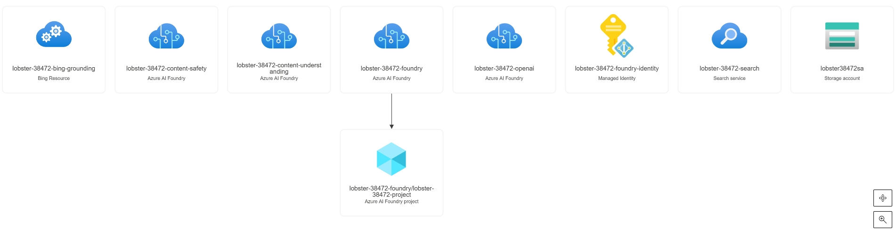

# Setup and Deployment

## Prerequisites
* A Posix compliant System. It could be one of the following:
    * [Github CodeSpaces](https://github.com/features/codespaces)
    * Azure Linux VM - Standard_B1s VM will work ($18/month)
    * Windows 11 with [Windows Subsystem for Linux](https://docs.microsoft.com/en-us/windows/wsl/install)
* [Azure CLI](https://docs.microsoft.com/en-us/cli/azure/install-azure-cli) - A tool for managing Azure resources
* [Taskfile](https://taskfile.dev/#/) - A single file task runner
* [Terraform](https://www.terraform.io/) - A tool for building Azure infrastructure and infrastructure as code
* An Azure subscription with Owner rights on the subscription
    * If you don't have an Azure subscription, create a [free account](https://azure.microsoft.com/en-us/free/)

## Task
* The [Taskfile](../Taskfile.yaml) definition is located in the root of the repository. It defines all the commands needed to build and tear down the Azure infrastructure.
* The variable `DEFAULT_REGION` in the [Taskfile](../Taskfile.yaml) can be changed to deploy to a different Azure region. The default is `eastus2`.

### Commands
* Running the `task` command without any options will run the default command. This will list all the available tasks.
    | Task |  Description | 
    | ------ | ------ |
    | `task apply` | Creates Azure infrastructure |
    | `task down`  | Destroys all Azure resources and cleans up Terraform |
    | `task init`  | Initializes Terraform workspace |
    | `task otel`  | Starts up .net Aspire for OTEL endpoints |
    | `task creds`  | Creates the environmental variable file from the Terraform outputs |
    | `task up`    | Builds a Complete AI Foundry - End to End Workshop Environment by running up, init, apply, creds |
    | `task venv-down` | Cleans up the python virtual environment |
    | `task venv-up` | Initialized python virtual environment and installs required modules |

## Azure Resources Created
* The following resources will be created in Azure when the `task apply` command is run.
* The resources will be tagged with `AI Foundry - End to End Workshop`
* The resources will be created with a randomize name in the format of `${pet_name}-${random_number}`
    | Resource |  Usage | 
    | ------ | ------ |
    | AI Foundry | The Parent AI Service |
    | Azure AI Foundry Project | The resource were models, tools, and agents will be deployed to |
    | Azure OpenAI Service | Used by AI Foundry Project for OpenAI models |
    | Azure AI Search Service | Dependent Service for AI Foundry |
    | User Assigned Managed Identity | The identity for the AI Foundry project  |
    | Azure Storage Account | Dependent Service for AI Foundry |
    | Azure Content Understanding Service | Next generation OCR with AI Foundry. Only available in WestUS at this time. |
    | Azure Content Safety Service | Prompt shielding and   |
    | Azure Bing Grounding Connection | Used by AI to leverage Bing |
    | Azure Application Insights | Monitoring for the AI Foundry and the Agents |

## Resource Creation 
1. ``` ➜  agentic-ai-lab git:(main) ✗ az login```
1. ``` ➜  agentic-ai-lab git:(main) ✗ task up``` 
1. ``` ➜  agentic-ai-lab git:(main) ✗ task creds ```  

### Example Deployment
```bash
    ➜  agentic-ai-lab git:(main) ✗ az login
    ➜  agentic-ai-lab git:(main) ✗ task up
    task: [init] terraform workspace new eastus2 || true
    Created and switched to workspace "eastus2"!

    You're now on a new, empty workspace. Workspaces isolate their state,
    so if you run "terraform plan" Terraform will not see any existing state
    for this configuration.
    task: [init] terraform workspace select eastus2
    task: [init] terraform init

    Initializing the backend...
    ...
    Changes to Outputs:
  + APP_NAME                            = (known after apply)
  + APP_RESOURCE_GROUP                  = (known after apply)
  + AZURE_AI_PROJECT_ENDPOINT           = (known after apply)
  + AZURE_AI_SEARCH_API_KEY             = (sensitive value)
  + AZURE_AI_SEARCH_ENDPOINT            = (known after apply)
  + AZURE_OPENAI_API_KEY                = (sensitive value)
  + AZURE_OPENAI_DEPLOYMENT             = "gpt-4o"
  + AZURE_OPENAI_ENDPOINT               = (known after apply)
  + AZURE_SUBSCRIPTION_ID               = "4e257472-b4cb-41cb-82b2-eee19d59307b"
  + EMBEDDING_MODEL_DEPLOYMENT_NAME     = "text-embedding-3-large"
  + GROUNDING_WITH_BING_CONNECTION_NAME = "bing-connection"
  + MODEL_DEPLOYMENT_NAME               = "gpt-4o"
  + PROJECT_CONNECTION_STRING           = (known after apply)
  + SERVICE_API_FOR_CU                  = "2025-05-01-preview"
  + SERVICE_FOR_CU                      = (known after apply)
  + TENANT_ID                           = "2ac65dc7-9e8d-49e6-a9d4-6bcfdc6adb1f"
    random_pet.this: Creating...
    random_id.this: Creating...
    random_id.this: Creation complete after 0s [id=lkg]
    ...
    azapi_resource.ai_search: Still creating... [1m50s elapsed]
    azapi_resource.ai_search: Still creating... [2m0s elapsed]
    azapi_resource.ai_search: Still creating... [2m10s elapsed]
    azapi_resource.ai_search: Still creating... [2m20s elapsed]
    azapi_resource.ai_search: Still creating... [2m30s elapsed]
    azapi_resource.ai_search: Still creating... [2m40s elapsed]
    ...
    azapi_resource.app_insights_connection: Creating...
    azapi_resource.app_insights_connection: Creation complete after 1s [id=/subscriptions/4e257472-b4cb-41cb-82b2-eee19d59307b/resourceGroups/lobster-38472-ai_rg/providers/Microsoft.CognitiveServices/accounts/lobster-38472-foundry/projects/lobster-38472-project/connections/app-insights-connection]
    azapi_resource.storage_connection: Creating...
    azapi_resource.storage_connection: Creation complete after 2s [id=/subscriptions/4e257472-b4cb-41cb-82b2-eee19d59307b/resourceGroups/lobster-38472-ai_rg/providers/Microsoft.CognitiveServices/accounts/lobster-38472-foundry/projects/lobster-38472-project/connections/storage-connection]

    Apply complete! Resources: 35 added, 0 changed, 0 destroyed.

    Outputs:

    APP_NAME = "lobster-38472"
    APP_RESOURCE_GROUP = "lobster-38472-ai_rg"
    AZURE_AI_PROJECT_ENDPOINT = "https://lobster-38472-foundry.services.ai.azure.com/api/projects/lobster-38472-project"
    AZURE_AI_SEARCH_API_KEY = <sensitive>
    AZURE_AI_SEARCH_ENDPOINT = "https://lobster-38472-search.search.windows.net"
```

### Getting Credentials
__Note__: This is optional after running the `task up` or `task apply` command to re-populate the `.env` file with the correct values.
```bash    
    ➜  agentic-ai-lab git:(main) ✗ task creds
        🔹 Now copy and paste the following command to source the variables:
        ➡️ `source ../.env`    
```

### Starting OTEL Endpoint
```bash
    ➜  agentic-ai-lab git:(main) ✗ task otel
```

### Tearing Down the Environment
```bash
    ➜  agentic-ai-lab git:(main) ✗ task down
```


## Created Resources 


# Navigation
‖ [Return to Main README 🏠](../README.md) ‖ 